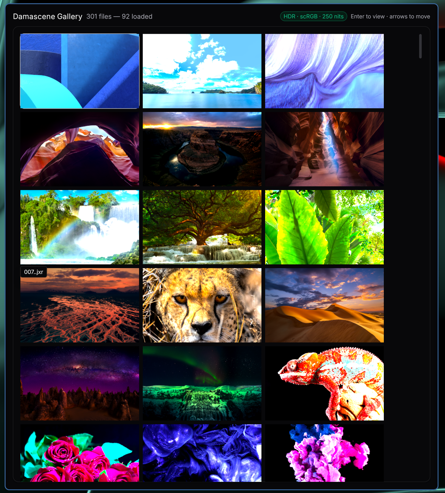

# damascene-gallery

A color-managed media gallery for Wayland, built with
[Damascene](https://github.com/computer-whisperer/damascene). Browses
directories of images — including the HDR formats nothing mainstream
opens (JPEG XR, JPEG XL, AVIF, OpenEXR, Radiance HDR) — and displays
them with correct color via `wp_color_management_v1`.

<p align="center">
  
</p>

```
damascene-gallery [DIRECTORY | FILE...]
```

Without arguments the app opens on a welcome screen; **Open Folder**
launches the system directory picker (XDG desktop portal, via `rfd`),
from there and from the gallery toolbar.

## Controls

| Key | Action |
| --- | --- |
| arrows / `hjkl` | move selection (grid) · prev/next (viewer) |
| Enter / double-click | open full-size viewer |
| Esc | back to grid |
| Home / End | first / last image |
| `t` | viewer: toggle SDR preview (tonemap to reference white) |
| `o` | open a different folder (system picker) |

## Architecture

- **Decode pipeline** (`src/decode`, `src/color.rs`, `src/cms.rs`):
  copied from [prism-bg] (2026-06-05), which stays unpublished. Magic-byte
  format dispatch; every decoder preserves the source's real color
  encoding (cICP, ICC via moxcms, format conventions). JPEG XR through
  vendored jxrlib (`vendor/jpegxr`, bindgen bumped to 0.72). The one
  local addition is `decode::load_straight` — damascene's image shader
  premultiplies at blend, so the gallery wants straight alpha.
- **`src/convert.rs`**: bridges the pipeline's `ColorEncoding` to
  damascene's `ColorSpace`. PQ is decoded to linear here, anchored at the
  declared reference white (BT.2408 203 cd/m² default) — damascene's own
  PQ decode anchors 1.0 at 10000 nits, which is wrong for compositing in
  an SDR-white-relative working space. scRGB linear (the Windows JXR
  convention, 1.0 = 80 cd/m² ≙ SDR white) passes through untouched.
  Thumbnails are area-averaged in linear light and kept fp16 so HDR
  highlights survive into the grid.
- **`src/loader.rs`**: decode worker pool. Three-tier queue — viewer
  full-size requests, then thumbnails for rows the grid actually
  realized, then the background sweep in file order. Results wake the
  host's 0 fps idle loop via `HostConfig::with_external_wakeup`.
- **`src/app.rs`**: damascene `App` — welcome screen (empty state with
  the folder picker; the picker dialog runs on its own thread and the
  result swaps in a fresh collection + loader pool), virtualized grid
  (`virtual_list`, one El row per grid row), full-size viewer with an
  LRU of 5 decoded 4K frames and ±1 prefetch. The toolbar badge shows
  what the host negotiated: green `HDR · linear` when an extended-range
  surface is attached, `SDR` otherwise.

HDR output negotiates per-output (`ColorPreferences::hdr_extended`) and
follows the window live across HDR/SDR outputs. Luminance fitting is
damascene's remastering pipeline (`dynamic-range-limit`, BT.2390
hue-preserving roll-off, per-image measured peak): grid thumbnails run
`ConstrainedHigh` (≤2× reference — a wall of 1000-nit tiles would be
hostile), the viewer runs `NoLimit` (full panel headroom; content
brighter than the panel remasters instead of clipping — including the
SDR-output case), and `t` flips the viewer to `Standard` for an SDR
preview of the same image.

[prism-bg]: https://github.com/computer-whisperer/prism-bg
